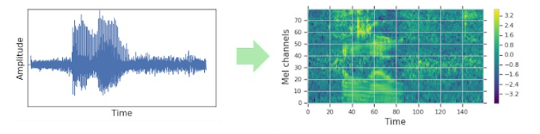
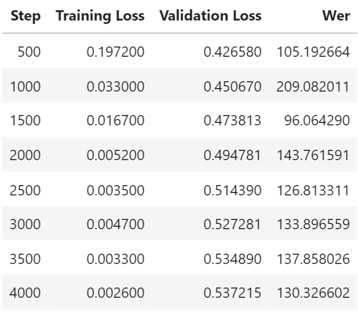
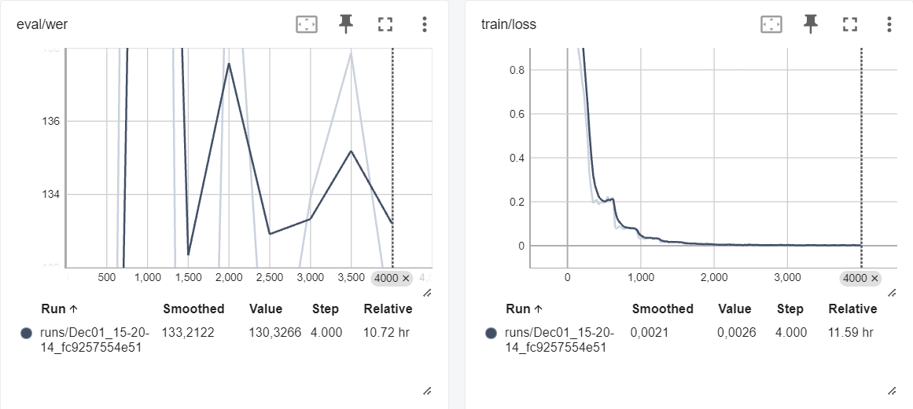

# Fine-Tuning Whisper for Italian Speech Transcription 🗪
The objective of this project is the fine-tuning of the Whisper translation model, by OpenAI, achieving the ability to efficiently transcribe Italian speech. This work has been separated into three steps to build a scalable pipeline.
Our reference can be found in the blog post 👉 [Fine-Tune Whisper 🤗](https://huggingface.co/blog/fine-tune-whisper). To build meaningful interactive applications, a Gradio interface was employed. 
The project does not limit itself to fine-tuning Whisper: to exploit the full capabilities of the model, we have added three functionalities, with the ultimate goal of realizing a 
Speech-to-Speech 🗪 system:
- **Speech-to-Text**: naturally performed by the fine-tuned Whisper model.
- **Summarization**: allowing the transcribed text to be summarized for clarity.
- **Translation**: turning the original Italian transcription into English to make it understandable by additional users.
- **PDF Saving**: allowing users to save the translated text into PDF and directly download the obtained file.
- **Text-to-Speech**: exploiting the pdf transcription, make it possible to turn the English text into English speech, effectively providing a complete translation of the original input file.

Every operation was performed on Google Colab. This platform has the advantages of offering a GPU for fast training and a container environment for easily handling dependencies and installations. However, its resource limitations (timed computation unit usage, limited storage space) have influenced some particular choices that were made in building the system.

## Feature Pipeline 🔊
The training dataset was obtained from 👉 [Mozilla Foundation's Common Voice 11.0 Dataset 🤗](https://huggingface.co/datasets/mozilla-foundation/common_voice_11_0/viewer/it), selecting the 'it' subset. Since the training split consists of more than 130.000 samples of audio and text transcriptions, its entire storage on Google Colab environment, and subsequently in Google Drive storage, was not deemed feasible. Instead, to ensure a comprehensive view of the dataset, a split of around 10% of the training set was chosen, after shuffling the samples and selecting them at random.
Whisper's feature extractor was leveraged to pad/truncate audio inputs to make their length 30 seconds and turn them into log-Mel spectrogram images. This operation was needed to adapt the data to the transformer's structure, which includes a convolution layer. However, **this choice will reflect its consequences on the model performance**. The text was then tokenized and combined with the feature extractor.
The audio sample rate, compared to its original of 48 kHz, has been reduced to 16 kHz for better storage exploitation, assuming not too much information was lost.
This preprocessing was concluded with a mapping operation to make all training samples in the wanted format. 

💾 For easy storage and retrieval, we have employed Google Drive. The drive was mounted and accessed to upload both training and testing sets, for an overall occupation of the total Cloud storage space.

## Training Pipeline 🏋️‍♂️
For the training, detailed in the `training_pipeline.ipynb` notebook, we have utilized Google Colab Tesla T4 GPU, allowing us to complete the process in around 20 hours. The previously processed data was recollected from the mounted drive and converted to PyTorch Tensors, by splitting, tokenizing, and padding the input features. As a principal evaluation metric, word error rate (WER) was used, defined as the ratio of errors in a transcript to the total words spoken. Using the Transformers library, we have loaded a previous Whisper small checkpoint to benefit from transfer learning. The training configuration includes a `per_device_train_batch_size` of 16, which strikes an effective balance between fast computation and resource usage. Frequent evaluations were performed every 500 steps, over a total number of 4000 training steps. Checkpoints were saved periodically in the local space and pushed to the HuggingFace repository of the model, paying attention to keeping folders synchronized. A breakdown of the evaluation metrics per checkpoint can be seen in the following figure.

Finally, the model was pushed to HuggingFace including relevant arguments for identification (language, tasks etc.). A sample Gradio user interface is also included in the notebook to visualize the correct functioning of the model.
We can see more in-depth performance metrics by consulting Tensorboard Training Metrics. 
 A smooth training error decrease indicates an expected pattern, however the spikes in WER, even if with an overall decreasing trend, may indicate additional steps to adjust the model learning, especially for such a complex task.

## Inference Pipeline 🎙️📝
The inference pipeline, detailed in a final notebook, shows a complex Gradio application which is then pushed to the HuggingFace space to host it. This approach allows to decouple the steps and experiment with the user interface. Our goal was to fully exploit the model capabilities. Three tabs are present in the applicaiton. 

🎙️📝 The first two allow to do audio transcription, summarization and translation, both using microphone/uploads and YouTube links. 

🗣 The third one instead performs a PDF conversion and Speech-to-Speech translation for a full audio transformation. In fact, the Italian audio is translated to English, made available to download in PDF format, and turned to English speech, which can be played and downloaded from Gradio. 

Four examples are available on the space, both in mp3 format and YouTube links. They were carefully selected to strike a balance between complexity, quality and reader-friendliness. The mp3 audios were generated by us using [Text-to-Speech Software](https://ttsmaker.com/).
The app was tested for performance, showing coherence with the expectations.
The HuggingFace space for accessing the model can be found here 👉 [Whisper_Speech2Speech_IT2ENG 🤗](https://huggingface.co/spaces/SaladSlayer00/Whisper_Speech2Speech_IT2ENG)

# Task 2 - Optimization
Our fine-tuning gave an overall satisfactory performance, allowing us to correctly trascribe audio files, as intended. However, some factors encountered while utilizing the model need to be pointed out:
- **Audio Quality**: the model performs notably better with audio inputs which present higher quality and low noise. This difference is particularly notable when comparing the outcomes of microphone input with the mp3 samples we generated. Microphone input can vary significantly in quality due to hardware differences, background noise, and recording environments.
- **Audio Length**: the model performs notably better with audio inputs with a length of 5 to 30 seconds. This is not unexpected, since the average sample length in the original dataset is around 5.3 seconds, and the audios were cut/padded, before training, to reach the same duration of 30 seconds top. This difference can also be observed in feeding different example audios to the model. Very short audio clips may not provide enough context for the model to accurately recognize speech, leading to poor performance, while clips over 30 seconds lead the model's context window to not effectively adapt. As a result, the model might repeat phrases or lose coherence.

Several strategies can be performed to improve the model's outcomes, divided into two specific categories.

## Model-Centric Approach
Fine-tuning hyperparameters is one of the most straightforward methods to improve model performance. The spikes in the WER could suggest that the learning rate might be too high, and make the model's weights can oscillate around the optimal values rather than converging. We may consider implementing learning rate schedules that decrease the learning rate over time, or try using learning rate finders to optimize this parameter. The spikes on WER patters are most likely due to inconsistent performance on the validation splits, given the peaks are seen every 500 steps. For a limited validation set, we can employ K-Fold Cross-Validation, and expect a smoother WER trend, at the cost of an increase in computational load which needs to be considered when using Colab as training environment. However, a crucial step for improving performance can be the inclusion of more samples (double te present set), to ensure a more balanced and comprehensive learning. While the actual performance does not suffer too much, further inclusion can make the model more robust to diverse inputs. This means that hyperparamenters would need to be tuned for adapting to the data better.  

## Data-Centric Approach
Given the nature of the model, which does not allow for great flexibility in the structural modifications, the main area of improvement can be found in the data used for fine-tuning. In fact, the Mozilla Foundation's Common Voice, while extremely valid and reliable, presents some notable limitations which need to be addressed. Since the record length is, on average, limited, the model cannot handle audio files (input or YouTube links) that extend for more than 30 seconds, given the defined padding. A consequence of this choice is reflected in model performance: we have experimented with multiple audio dimensions and the presence of excessive length causes repetitions, instability, errors and absence of words in the outputs. The model's context window can be expanded by employing a different data source which includes longer Italian labeled audio samples, like 
[StageZero Technologies STT Dataset](https://stagezero.ai/italian-speech-recognition-dataset/), which can reach up to 1 hour of length. These files can be split and then concatenated to form better outputs. 

Another issue can be identified in the discrepancy in input audio quality. While the dataset includes a variety of samples that allow it to be robust to noise, this precaution may not be enough, given the limited amount of training steps. For this reason, cleaner input audios, like the ones generated by us with software, do not suffer from the same noisiness of microphone speech, which suffers from a higher rate of error. This problem has been addressed with the inclusion of a Python script which performs **quality enhancements on audio samples**, using the Librosa, Soundfile and Numpy libraries, to improve inference outcomes. 

## Audio Quality Enhancement
We have experimented on some samples which have been crafted to include noise: in the example included in the `audio_enhancement` folder, after performing enhancements, the WER on model transcription has decreased from 13% to 5%, making it a viable way of obtaining better outcomes for inference on mic-recorded clips.
The original *Ciao, mi chiamo Beatrice, ho ventitre anni e abito in Italia, mi piace molto andare in giro a fare compere e studiare.* is an audio sample of 12 seconds, a dimension which lets the model perform efficiently, that includes some noisiness (me shaking a towel). We can see that, in the second image, it has been transcribed more closely compared to the first, non-enhanced version.

